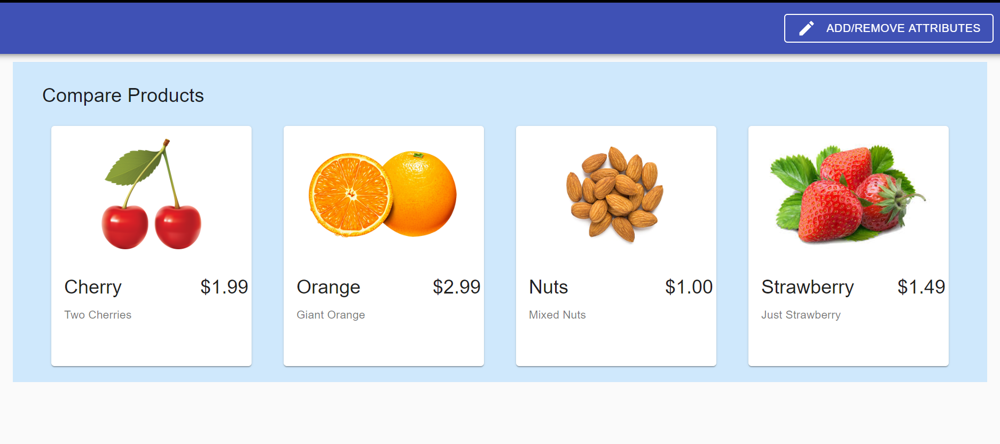
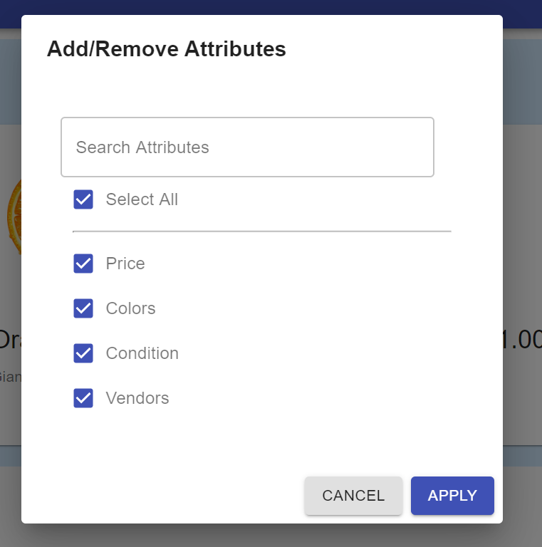
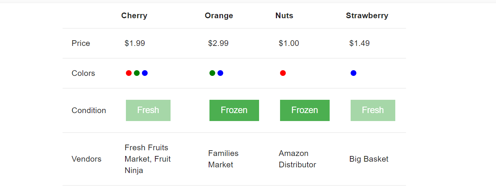

This project is created using React Hooks, React material ui and this sample project is used to compare products using their attributes after user select the products.  

https://anil-choudhary-1993.github.io/product_compare_app_using_react_hooks/

## Available Scripts

In the project directory, Runs the app in the development mode.  
### `yarn start`
Open (http://localhost:3000) to view it in the browser.

Builds the app for production to the `build` folder. 
It correctly bundles React in production mode and optimizes the build for the best performance.
### `yarn build`
The build is minified and the filenames include the hashes. 
Your app is ready to be deployed!

Product Screen

Select Attributes Screen

Compare Products table

